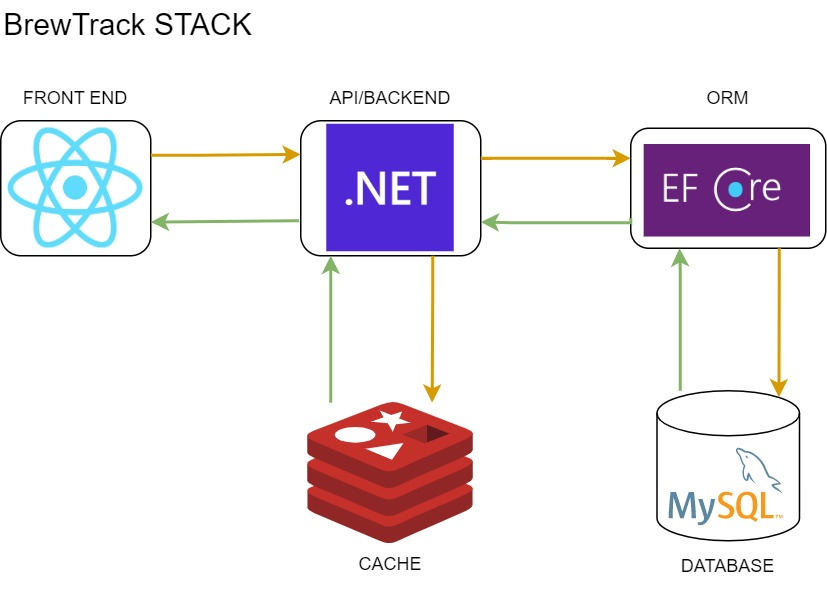

# BrewTrack Readme

## Introduction


This is a mock assesment project that provides a single source of information about brew pubs for customers.

## Stack

1. React Front End
2. .NET backend
3. MySQL Database
4. Redis



## Prerequisites

In order to run this project an environment will require the following as prereqs:
 
1. Nodejs v18.16.0 or later
2. .NET sdk 7.0.203
3. .NET Ef Cli

For the app to run locally container apps were used for MySQL and Redis.

## Application Local Dev Infrastructure

To run this app on a local machine these optional steps may be followed to start required application infrastructure as container services.

```bash
cd infra
docker compose -d up
```

## Configuration

To configure the application with its required infrastructure please create a `appsettings.Development.json` file and append these values to it.

```
  "WeatherApiKey": "<weather api key>",
  "ConnectionStrings": {
    "MySql": "Server=localhost;Port=3306;User ID=root;Database=BrewTrack",
    "Redis": "localhost:6379"
  }
 ```

> Note: When running the provided containers as support infrastructure the `ConnectionStrings` section of the config can be used verbatim. WeatherApiKey api key is still required.

## Data Migrations

The data migrations are executed when the application starts and will bring any connected MySQL database up to speed if the database stipulated in the connection string has been created in a instance of MySQL.

## Run the app

Run the application while in the project root directory `dotnet run`. 

# Architecture

### ARCHITECTURAL PATTERN


